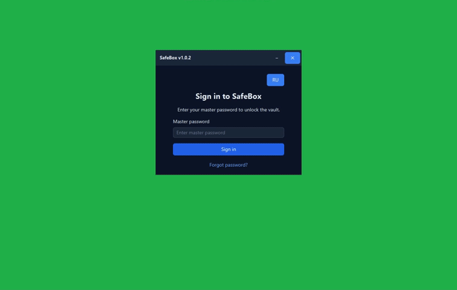

# SafeBox

  

  <strong style="font-size: 1.25em;">v1.0.2</strong>

  

  <a href="https://github.com/IAMBloodSUCKER/SafeBox/releases">Все версии</a>

**SafeBox** — минималистичное десктопное приложение для безопасного локального хранения паролей. Без облаков, без серверов, один мастер-пароль.

## Особенности

- Один мастер-пароль для всего хранилища
- AES-256-GCM шифрование паролей и заметок
- Локальное хранение в `~/.safebox/`
- Копирование в буфер с автоочисткой через 30 секунд
- Быстрый поиск по сайту и логину
- Генератор паролей с настройками
- Экспорт и импорт резервных копий `.safebox`
- Светлая и тёмная тема, русский и английский интерфейс
- Автоблокировка при бездействии (5 минут)

## Установка

Нажмите **Download** выше или скачайте последний `SafeBox-*.exe` в [Releases](https://github.com/IAMBloodSUCKER/SafeBox/releases) и запустите установщик.

## Безопасность

- Мастер-пароль **не хранится** на диске.
- Пароли и заметки шифруются AES-256-GCM; ключ выводится через PBKDF2-HMAC-SHA256 (600 000 итераций).
- Данные остаются только на вашем компьютере.
- **Восстановление невозможно** при потере мастер-пароля — делайте резервные копии.

## Автор

**BloodSUCKER** — [github.com/IAMBloodSUCKER](https://github.com/IAMBloodSUCKER)
